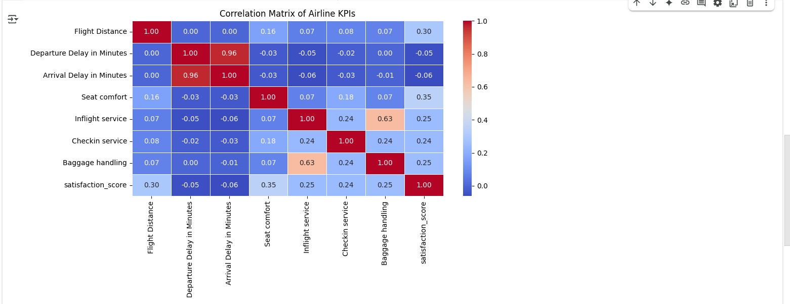
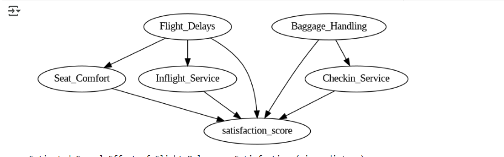

# Airline Performance & Flight Delays Analysis

## Table of Content

1. [Introduction](#Introduction)
2. [Research Objective](#research-objective)
3. [Exploratory Data Analysis (EDA)](#exploratory-data-analysis-eda)  
   a. [Flight Route Mapping](#flight-route-mapping)  
   b. [Airports with Worst Delays](#airports-with-worst-delays)  
   c. [Delay Types Across Airlines](#delay-types-across-airlines)  
   d. [Satisfaction Correlation with Delays](#satisfaction-correlation-with-delays)  
4. [Statistical Analysis](#statistical-analysis)  
   a. [Correlation Heatmap](#correlation-heatmap)  
   b. [Causal Inference Model](#causal-inference-model)  
5. [Key Insights](#key-insights)
6. [References](#references)

## Introduction
Flight delays significantly impact passengers and airline operations. This project leverages data visualization in Tableau to analyze flight delay patterns, determine their causes, and assess airline performance. By examining historical flight data, we aim to provide insights that help reduce delays and enhance customer experience.

[Read Detailed Background Information Here](https://github.com/Yamunas123/BSAD_482_Project/blob/main/Background.md)

## Research Objective
The primary goal is to understand and quantify the impact of various types of flight delays on passenger satisfaction. Using multiple datasets from Kaggle, we focus on:

* Most Impacted Airports by Flight Delays: Identifies airports with the highest average delay times.

* Flight Route Traffic & Delay Mapping: Visual representation of flight routes and their delay frequencies.

* Delay Types by Airline: Breakdown of different delay types (Weather, Carrier, NAS, Security, Late Aircraft) across airlines.

* Correlation Between Delay Duration and Passenger Satisfaction: Identifies how increasing delay times impact passenger satisfaction across various service factors.

Through the integration of exploratory visualizations and statistical methods, this project helps stakeholders in the airline industry make data-driven decisions.

## Exploratory Data Analysis (EDA)

We used Tableau and Tableau Prep to visualize key patterns in delay performance and satisfaction across U.S. airports.

### a. Flight Route Mapping
Mapped the most trafficked flight routes and identified delay concentrations across major airports.

### b. Airports with Worst Delays
Bar chart highlighting the airports with the **highest average arrival delays**, helping to pinpoint regions with consistent service issues.

### c. Delay Types Across Airlines
Visual breakdown of the **types of delays** (Carrier, Weather, NAS, Security, Late Aircraft) grouped by airline.

### d. Satisfaction Correlation with Delays
Visual comparisons of satisfaction scores based on delay experiences across **service metrics** like seat comfort, check-in service, and baggage handling.

[See Full Wrangling & EDA Summary](Wrangiling.md)

## Statistical Analysis

We applied both **correlation analysis** and **causal inference modeling** to explore the relationship between delays and satisfaction.

### Correlation Heatmap

- Strong correlation between **Departure Delay** and **Arrival Delay**.
- Positive correlation between service quality metrics and satisfaction.
- Weak but negative correlation between **Flight Delays** and **Satisfaction Score**.

> Correlation identifies patterns — but to assess true causality, we used DoWhy for inference.

---

### Causal Inference Model

We built a **Directed Acyclic Graph (DAG)** to represent our assumptions:
- **Flight Delays** affect **Satisfaction** directly and indirectly through:
  - Seat Comfort
  - Inflight Service
- **Check-in Service** and **Baggage Handling** play a supportive role.

We then used the **DoWhy library** to compute the **Average Treatment Effect (ATE)** using **backdoor adjustment (linear regression)**.

[See Full Causal Analysis & Results](CausalAnalysis.md)

## Key Insights

- Delays not only reduce satisfaction, but they also interact with service factors to compound frustration.
- Improving inflight experience and check-in efficiency can help airlines maintain satisfaction during unavoidable delays.
- High-delay airports and routes present opportunities for targeted operational improvements.

## References
- US Domestic Flight Delays Dataset
Kaggle: https://www.kaggle.com/datasets/giovamata/airlinedelaycauses

- Airline Dataset 
  Kaggle: https://www.kaggle.com/datasets/flashgordon/usa-airport-dataset
  
- Airline Passenger Satisfaction Dataset
Kaggle: https://www.kaggle.com/datasets/teejmahal20/airline-passenger-satisfaction
